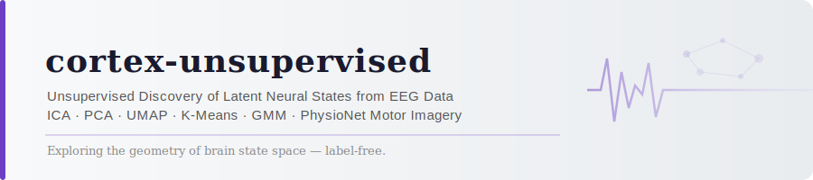
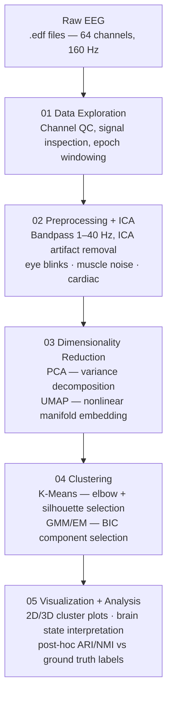

<p align="center">
  
</p>

<p align="center">
  
  
  
  
  
  
</p>

---

<p align="center">
  <em>Can we recover meaningful brain states purely from the structure of EEG data — without any labels?</em>
</p>

---

## Overview

**cortex-unsupervised** is an independent research pipeline for **label-free neural state discovery** from EEG signals. Using 64-channel motor imagery data from PhysioNet, the pipeline applies a full unsupervised ML stack — artifact removal, dimensionality reduction, and probabilistic clustering — to identify latent cognitive states embedded in raw brain activity.

This project sits at the intersection of **ML algorithm design** and **computational neuroscience**, with a long-term research focus on neural dynamics at the boundaries of consciousness — including altered, boundary, and terminal brain states.

This is independent research conducted outside of any coursework or institutional affiliation.

---

## Research Question

> *Can unsupervised machine learning recover interpretable neural states from EEG motor imagery data — and what does the geometry of brain state space reveal about how the brain organizes itself?*

### Why It Matters

Neural signals are high-dimensional, noisy, and temporally structured. Supervised approaches require labeled data — expensive in clinical and BCI settings. Unsupervised methods offer a path toward:

- **Label-free brain-computer interface (BCI) state detection**
- **Exploratory neural dynamics analysis** without clinical annotation
- **Hypothesis generation** for downstream supervised modeling
- **Computational characterization** of consciousness boundaries — applicable to altered, anesthetic, and terminal brain states

---

## Dataset

**PhysioNet EEG Motor Movement/Imagery Dataset (EEGMMIDB)**

| Property | Details |
|---|---|
| **Subjects** | 109 |
| **Channels** | 64-channel EEG |
| **Sample Rate** | 160 Hz |
| **Tasks** | Rest, real/imagined fist movement, real/imagined foot movement |
| **Labels** | Withheld during unsupervised learning — used only for post-hoc validation |
| **Source** | [physionet.org/content/eegmmidb/1.0.0](https://physionet.org/content/eegmmidb/1.0.0/) |

Place raw `.edf` files in `data/raw/`.

---

## Pipeline Architecture



---

## Methods

| Stage | Technique | Rationale |
|---|---|---|
| **Artifact Removal** | ICA (FastICA) | Separates neural signal from ocular, muscular, and cardiac noise |
| **Feature Extraction** | Band power (δ, θ, α, β, γ) | Captures frequency-domain neural dynamics |
| **Dimensionality Reduction** | PCA → UMAP | PCA for variance capture; UMAP for nonlinear manifold structure |
| **Clustering** | K-Means + GMM | K-Means for hard assignments; GMM for probabilistic soft membership |
| **Model Selection** | BIC (GMM), Silhouette + Elbow (K-Means) | Principled component/cluster count selection |
| **Validation** | ARI, NMI vs ground truth task labels | Post-hoc only — no labels used during learning |

---

## Repo Structure

```
cortex-unsupervised/
├── assets/
│   └── banner.svg
├── data/
│   ├── raw/                        # Raw .edf files (gitignored)
│   └── processed/                  # Preprocessed epochs, feature matrices
├── notebooks/
│   ├── 01_data_exploration.ipynb
│   ├── 02_preprocessing_ica.ipynb
│   ├── 03_dimensionality_reduction.ipynb
│   ├── 04_clustering.ipynb
│   └── 05_visualization_analysis.ipynb
├── src/
│   ├── preprocessing/
│   │   ├── loader.py               # EDF loading, epoching
│   │   ├── filtering.py            # Bandpass, notch filtering
│   │   └── ica_artifact_removal.py
│   ├── dimensionality_reduction/
│   │   ├── pca_reduction.py
│   │   └── umap_embedding.py
│   ├── clustering/
│   │   ├── kmeans_states.py
│   │   ├── gmm_states.py
│   │   └── model_selection.py      # BIC, silhouette, elbow
│   └── visualization/
│       ├── cluster_plots.py
│       └── brain_state_plots.py
├── results/
│   ├── figures/
│   └── reports/
├── requirements.txt
├── .gitignore
└── README.md
```

---

## Project Status

| Component | Status |
|---|---|
| Repo scaffold + architecture | ✅ Complete |
| Data exploration notebook | 🔄 In progress |
| Preprocessing + ICA pipeline | 📋 Planned |
| Dimensionality reduction | 📋 Planned |
| Clustering + model selection | 📋 Planned |
| Visualization + analysis | 📋 Planned |
| Results write-up | 📋 Planned |

---

## Installation

```bash
git clone https://github.com/ssommera/cortex-unsupervised.git
cd cortex-unsupervised
pip install -r requirements.txt
```

### Requirements

```
mne>=1.6.0
scikit-learn>=1.4.0
umap-learn>=0.5.6
numpy>=1.26.0
pandas>=2.2.0
matplotlib>=3.8.0
plotly>=5.20.0
scipy>=1.12.0
jupyterlab>=4.0.0
```

---

## Related Work

- Makeig et al. (1996) — ICA applied to EEG artifact separation
- Tipping & Bishop (1999) — Probabilistic PCA
- McInnes et al. (2018) — UMAP: Uniform Manifold Approximation and Projection
- Borjigin et al. (2023) — Surge of neurophysiological activity at the hour of death
- Sommer (2024) — R2L Intrusion Detection via Ensemble Methods *(prior work)*

---

## Connection to Broader Research

**cortex-unsupervised** exists alongside a parallel research initiative:

**[The Bill Coleman Project](https://github.com/ssommera/Bill_Coleman_Project)** — AI-powered early detection of small cell lung cancer and prediction of immunotherapy-induced pulmonary toxicity.

Together, these projects represent two sides of the same research question:

> *What happens to a person on the way out — and could we have done more on the way in?*

---

## License

MIT License. Data sourced from PhysioNet under their open access policy.

*This is an independent research project and is not affiliated with Georgia Institute of Technology or any coursework.*

---

<p align="center">
  <em>Exploring the geometry of brain state space — label-free.</em>
</p>